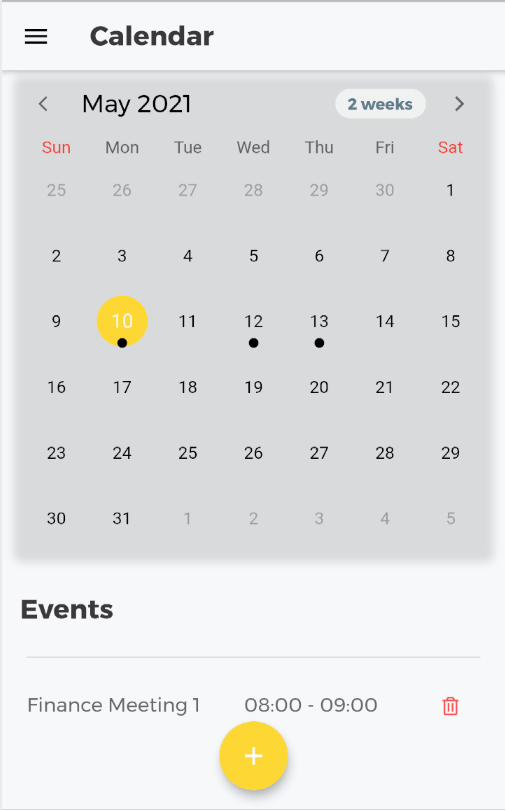
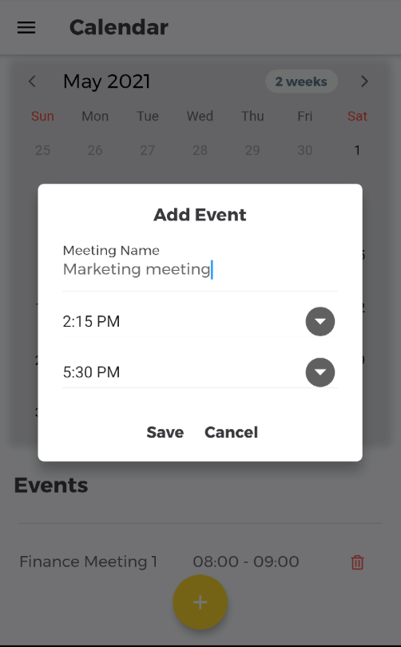
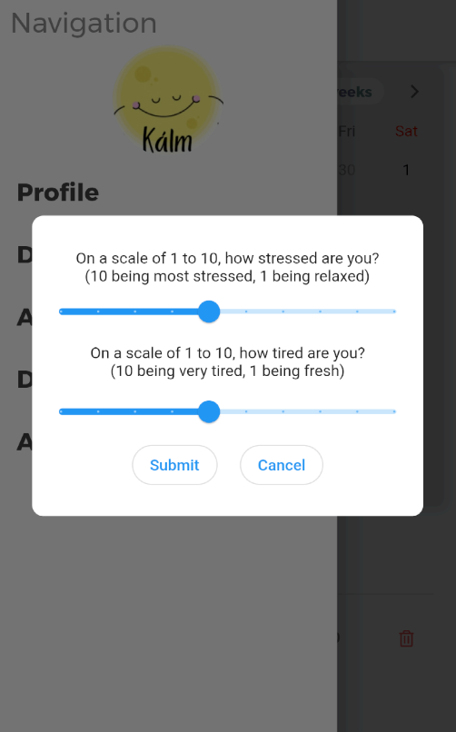
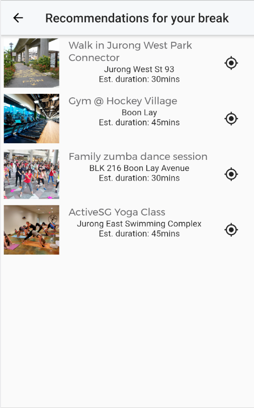
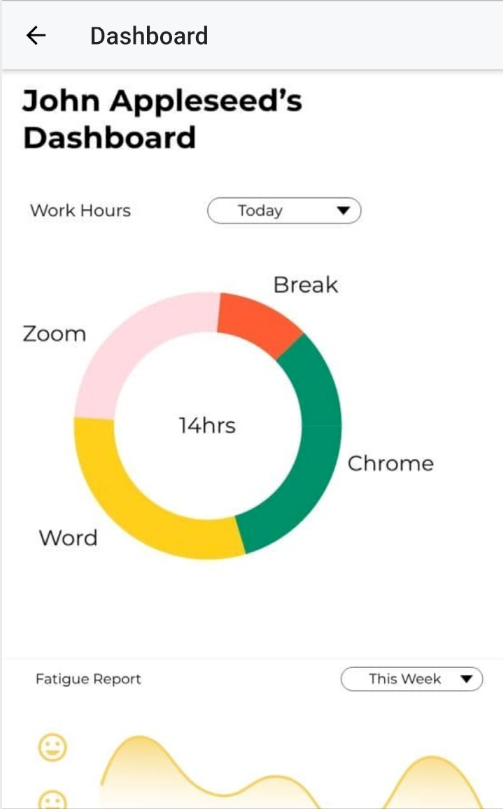

# flutter_app

Ground Zero 2021

This project is built for GroundZero2021. Our team is Oars.

### Homepage

The homepage is very basic and shows a calendar of upcoming events of user's schedule.

The small button at the bottom allows you to add events/meetings in 15 minutes period.

This daily survey helps developers or users to keep track of their mood, fatigue and stress level. This data helps developers to input into the AI algorithm.

This recommendations are generated through factors of user profile such as interests, age and residential location.

This dashboard page allows employees or employers to track the overall weekly screen-time and break-time. It also shows graphical representations of the mood or stress level.

### Tech stack
Flutter and SQFlite

### Future developments
1. Improvised AI recommendation system using Machine Learning.
2. User login and credentials verifying.
3. 

References:
https://github.com/aphrx/flutter_calendar

## Getting Started
A few resources to get you started if this is your first Flutter project:

- [Lab: Write your first Flutter app](https://flutter.dev/docs/get-started/codelab)
- [Cookbook: Useful Flutter samples](https://flutter.dev/docs/cookbook)

For help getting started with Flutter, view our
[online documentation](https://flutter.dev/docs), which offers tutorials,
samples, guidance on mobile development, and a full API reference.
